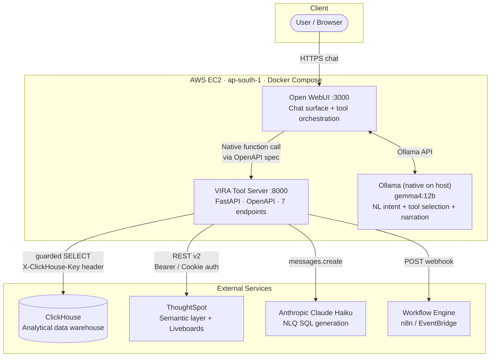
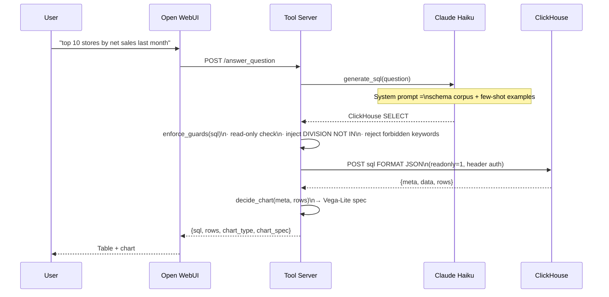
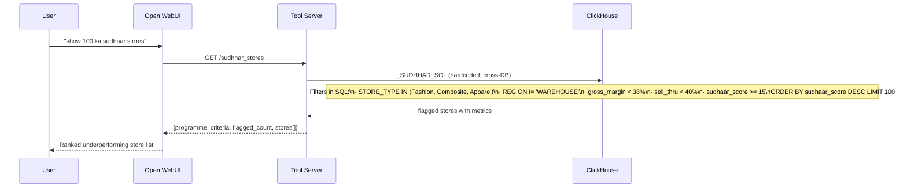
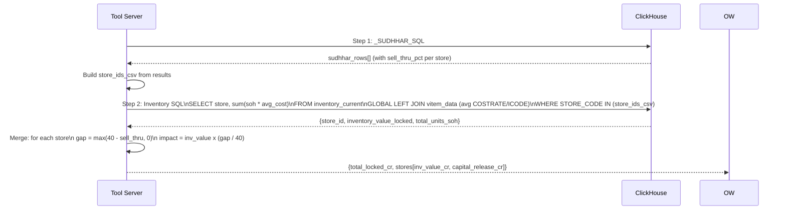
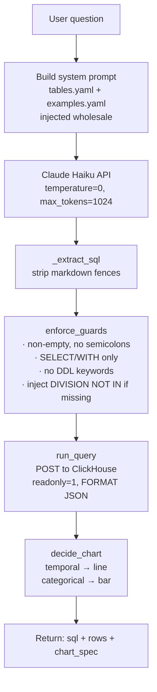
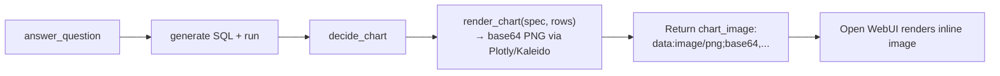
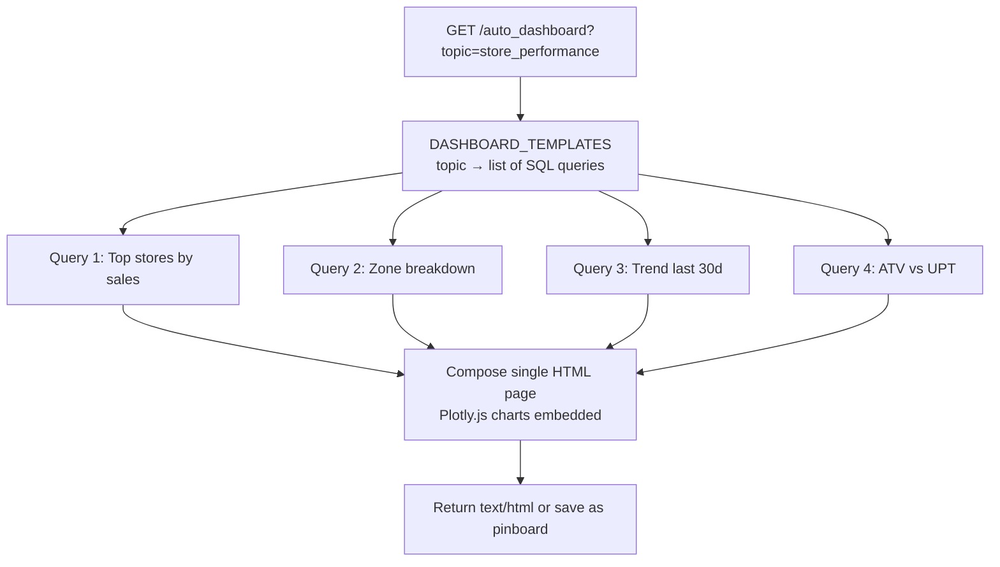
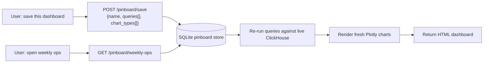
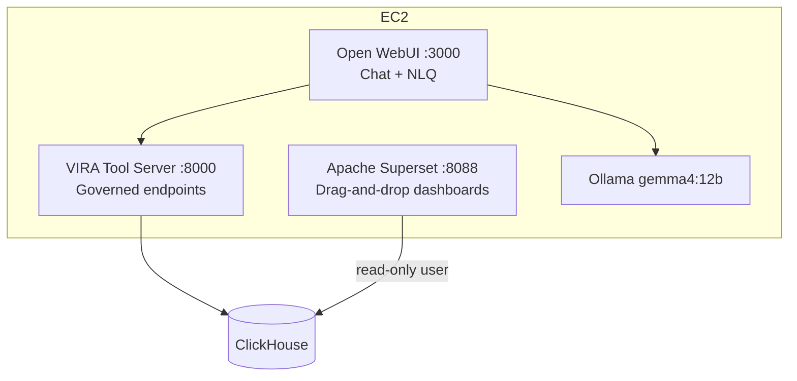

# VIRA Vision — Architecture

## Design Principle

**Gemma routes. Deterministic code decides.**

The local 12B model interprets user intent, selects a tool, and narrates results.
Every correctness-critical decision lives in code — SQL safety, mandatory business filters,
chart type selection, anomaly thresholds, workflow routing.
A model mistake degrades phrasing quality; it cannot corrupt data or bypass business rules.

---

## System Architecture



---

## Data Flow: `answer_question`

Four-stage pipeline: intent → SQL → guard → execute → chart.



---

## Data Flow: `sudhhar_stores` (100 Ka Sudhaar)

Pre-validated SQL — no NLQ, guaranteed correctness.



---

## Data Flow: `sudhhar_inventory_analysis`

2-step Python merge: Sudhaar list → inventory cost → financial impact.



---

## NL→SQL Pipeline (Detail)



---

## Security Model

| Layer | Mechanism |
|---|---|
| ClickHouse auth | `X-ClickHouse-User` + `X-ClickHouse-Key` headers — never in URL |
| ClickHouse access | `readonly=1` param + SQL guard rejects all non-SELECT |
| Business filters | Injected by `enforce_guards()` even if the LLM omits them |
| ThoughtSpot auth | Cookie+CSRF → Bearer token → Username+Password → Trusted key |
| CORS | `ALLOWED_ORIGINS` env var — tighten from `*` before production |
| Secrets | `.env` gitignored; never hardcoded in source |

---

## Deployment

```
AWS EC2 · ap-south-1
├── Ollama (native, GPU access, always-on)
│   └── gemma4:12b
└── Docker Compose
    ├── open-webui  :3000  ← user-facing chat
    └── vira-tools  :8000  ← tool server (FastAPI)

External (managed, no deploy needed)
├── ClickHouse   (read-only access via API key)
└── ThoughtSpot  (REST v2, trial or managed)
```

**Remote access options** (choose one; do not open ports without TLS):
- SSH tunnel: `ssh -L 3000:localhost:3000 ubuntu@<ec2-ip>`
- Reverse proxy: Caddy or Nginx + TLS on a subdomain
- Cloudflare Tunnel: zero-port-opening, free tier

---

## ClickHouse Schema

```
vmart_sales.dt_pos_transactional_data   ← main POS fact table (Distributed)
vmart_sales.stores                      ← store master
vmart_product.inventory_current         ← current SOH snapshot
vmart_product.vitem_data                ← item/article master (COSTRATE, MRP)
```

Cross-database queries use `GLOBAL LEFT JOIN` (ClickHouse distributed join pattern).
`BILLDATE` is IST wall-clock in a UTC-typed column — no timezone conversion needed.
`COSTRATE` stored as String — use `toFloat64OrZero(COSTRATE)` in all math.
`vitem_data` has multiple rows per ICODE — always pre-aggregate (`avg`) before joining.

---

## Roadmap — Auto Dashboarding

Current gap: charts are returned as Vega-Lite JSON specs but not rendered —
Open WebUI shows tables only. ThoughtSpot-like auto-dashboarding requires 4 phases:

### Phase 1 — Chart Rendering in Chat (1–2 days)

Render charts as base64 PNG or inline Plotly HTML inside the Open WebUI chat bubble.



**Changes needed:** add `plotly` + `kaleido` to requirements.txt, add `render_chart()` to
`charts.py`, return `chart_image` field from `answer_question`.

### Phase 2 — Auto Dashboard Endpoint (3–4 days)

One API call → full HTML page with 4–6 charts for a business topic.



Starter topics: `store_performance`, `sudhhar_overview`, `inventory_health`, `zone_comparison`.

### Phase 3 — Pinboards / Saved Dashboards (3–5 days)

Save, name, and reload multi-chart dashboards. Data refreshes live on every load.



### Phase 4 — Apache Superset (1–2 weeks)

Add Superset to Docker Compose as a proper self-serve BI surface.



Superset connects directly to ClickHouse with a read-only credential.
`vira-tools` remains the governed layer for chat; Superset serves power users.

---

## Phased Delivery

| Phase | Milestone |
|---|---|
| 1 — Foundation | Ollama + gemma4:12b, CH/TS connectivity, schema corpus |
| 2 — Core | Tool server live, NLQ validated on real schema, Open WebUI wired |
| 3 — Capabilities | 100 Ka Sudhaar, inventory analysis, anomaly checks, first webhook |
| 4 — Hardening | Tighten CORS, dedicated TS service account, reverse proxy + TLS |
| 5 — Auto Dashboard | Chart rendering, auto-dashboard endpoint, pinboards, Superset |
