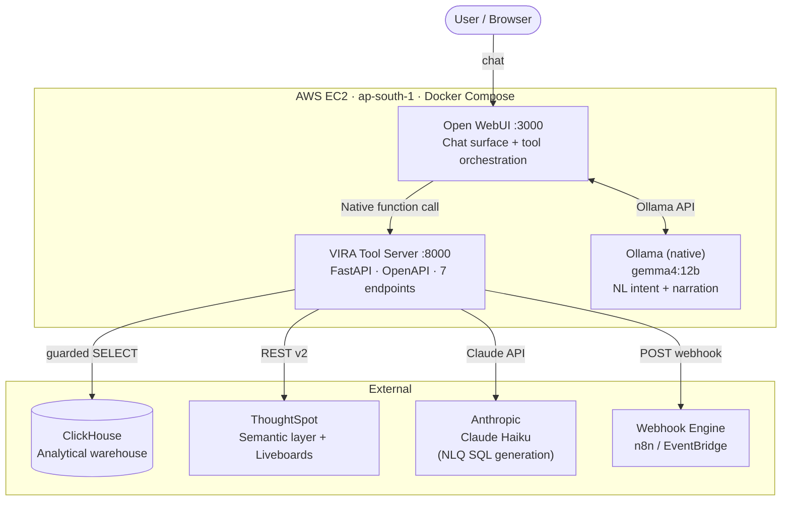

# VIRA Vision

> Self-service retail analytics chatbot — NL→SQL over ClickHouse, 100 Ka Sudhaar store programme, inventory analysis, anomaly detection, and workflow automation. Deployed on a single AWS EC2 with Open WebUI + local Gemma 4 + FastAPI.

## Architecture



## What it does

| Tool | Endpoint | Path |
|---|---|---|
| NL Query | `POST /answer_question` | NL → Claude SQL → ClickHouse → chart |
| 100 Ka Sudhaar stores | `GET /sudhhar_stores` | Pre-validated SQL → ClickHouse |
| Inventory analysis | `GET /sudhhar_inventory_analysis` | 2-step ClickHouse → Python merge |
| Governed search | `POST /governed_search` | ThoughtSpot REST v2 |
| Anomaly detection | `POST /detect_anomalies` | ClickHouse aggregate + z-score |
| Open liveboard | `POST /open_liveboard` | ThoughtSpot embed URL + data |
| Trigger workflow | `POST /trigger_workflow` | External webhook |

### Business Rules (built-in, cannot be bypassed)
- **Read-only**: only `SELECT`/`WITH` — no writes, no DDL
- **Division filter**: `DIVISION NOT IN ('Others','Fixed Assets',...)` injected on every NLQ query
- **Store filter**: only `STORE_TYPE IN ('Fashion','Composite','Apparel')`
- **Warehouse exclusion**: `REGION != 'WAREHOUSE'` on all store-level queries
- **100 Ka Sudhaar threshold**: `sudhaar_score >= 15` (margin < 38% AND sell-thru < 40%)

## Quickstart (EC2)

```bash
git clone https://github.com/dineshsrivastava07-cell/vira-vision.git
cd vira-vision
cp .env.example .env            # Fill: WEBUI_SECRET_KEY, CLAUDE_API_KEY, CH_KEY
bash scripts/01-install-ollama.sh
bash scripts/00-preflight.sh
python tests/smoke.py           # Must print 0 failed
bash scripts/02-up.sh
# Follow scripts/03-register-tools.md to wire Open WebUI
bash scripts/04-smoke-test.sh
```

Or hand `CLAUDE.md` to Claude CLI for a gated, automated runbook execution.

## Configuration (`.env`)

| Variable | Required | Description |
|---|---|---|
| `WEBUI_SECRET_KEY` | ✅ | Open WebUI session secret |
| `CLAUDE_API_KEY` | ✅ | Anthropic API key (NLQ SQL generation) |
| `CLAUDE_MODEL` | — | Default: `claude-haiku-4-5-20251001` |
| `CH_URL` | ✅ | ClickHouse HTTP endpoint |
| `CH_USER` | ✅ | ClickHouse username |
| `CH_KEY` | ✅ | ClickHouse password (header auth, never in URL) |
| `CH_DATABASE` | ✅ | Default database name |
| `EXCLUDED_DIVISIONS` | ✅ | Divisions to always exclude from NLQ |
| `TS_HOST` | — | ThoughtSpot host URL |
| `TS_SESSION_COOKIE` + `TS_CSRF_TOKEN` | one of | Google SSO workaround |
| `TS_BEARER_TOKEN` | one of | Browser session token |
| `TS_USERNAME` + `TS_PASSWORD` | one of | Service account |
| `TS_DEFAULT_WORKSHEET` | — | Default ThoughtSpot logical table GUID |
| `WORKFLOW_WEBHOOK_BASE` | — | n8n / EventBridge base URL |
| `ALLOWED_ORIGINS` | — | CORS origins (`*` for dev; tighten for prod) |

## Repo Layout

```
vira-vision/
├── CLAUDE.md                      # Ordered, gated build & deploy runbook
├── ARCHITECTURE.md                # System design, data flows, roadmap
├── .env.example                   # All config variables (copy → .env)
├── docker-compose.yml             # Open WebUI + vira-tools
├── scripts/
│   ├── 00-preflight.sh            # Verify connectivity
│   ├── 01-install-ollama.sh       # Pull gemma4:12b
│   ├── 02-up.sh                   # Build + start containers
│   ├── 03-register-tools.md       # UI steps to wire Open WebUI
│   └── 04-smoke-test.sh           # Live E2E smoke test
├── tool-server/
│   ├── Dockerfile
│   ├── requirements.txt
│   └── app/
│       ├── main.py                # All FastAPI endpoints
│       ├── config.py              # Settings from env
│       ├── nlq.py                 # NL → ClickHouse SQL (Claude API)
│       ├── clickhouse_client.py   # SQL guard + execution
│       ├── charts.py              # Chart-type decision → Vega-Lite spec
│       ├── anomaly.py             # Z-score anomaly detection
│       ├── workflows.py           # Webhook trigger
│       ├── thoughtspot_client.py  # ThoughtSpot REST v2
│       └── schema/
│           ├── tables.yaml        # NL→SQL schema corpus
│           └── examples.yaml      # NL→SQL few-shot examples
├── embed/
│   └── liveboard.html             # ThoughtSpot Visual Embed SDK
└── tests/
    └── smoke.py                   # Offline unit tests (no network)
```

## Roadmap — Auto Dashboarding

See [ARCHITECTURE.md](./ARCHITECTURE.md#roadmap--auto-dashboarding) for the full plan.

| Phase | What | Status |
|---|---|---|
| 1 | Chart rendering in chat (Plotly base64 PNG) | Planned |
| 2 | `/auto_dashboard` endpoint — topic → 4–6 charts as HTML | Planned |
| 3 | Pinboards — save/load named dashboards with live data | Planned |
| 4 | Apache Superset as standalone BI dashboard surface | Planned |

## License

MIT
